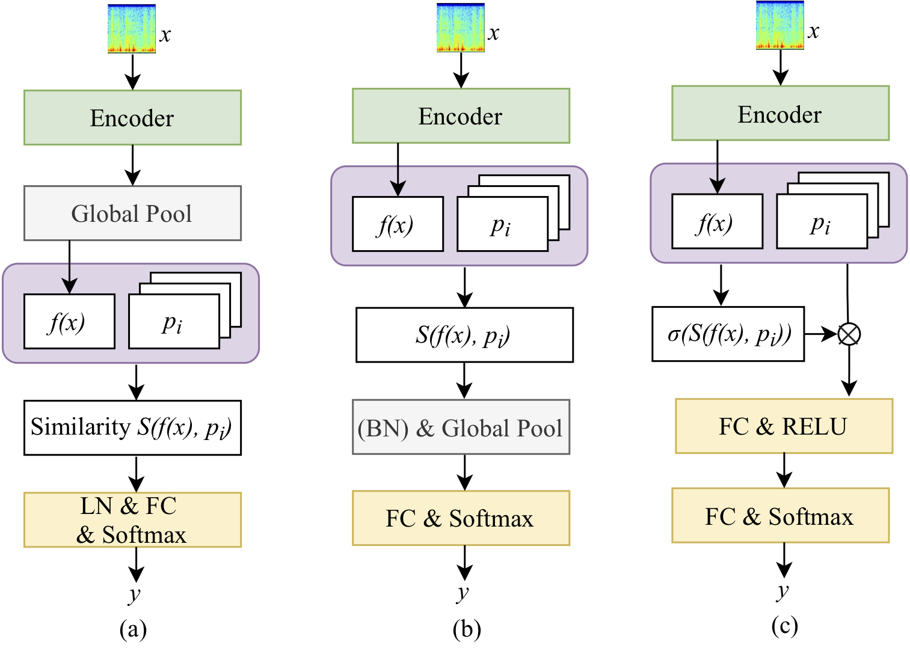

# Prototype Learning for Interpretable Respiratory Sound Analysis
[](https://arxiv.org/abs/2110.03536)
[](https://huggingface.co/models)



This is a Python and PyTorch code for the prototype learning framework in our paper: 

<!--[Prototype learning for interpretable respiratory sound analysis](https://arxiv.org/pdf/2110.03536.pdf).-->

>Zhao Ren, Thanh Tam Nguyen, and Wolfgang Nejdl. Prototype Learning for Interpretable Respiratory Sound Analysis. In ICASSP 2022.

## Citation

```
@article{zhao2022prototype,
  title={Prototype Learning for Interpretable Respiratory Sound Analysis},
  author={Ren, Zhao and Nguyen, Thanh Tam and Nejdl, Wolfgang},
  booktitle = {{IEEE} International Conference on Acoustics, Speech and Signal Processing},
  year={2022}
}
```

or 

```
@misc{ren2022prototype,
      title={Prototype Learning for Interpretable Respiratory Sound Analysis}, 
      author={Zhao Ren and Thanh Tam Nguyen and Wolfgang Nejdl},
      year={2022},
      eprint={2110.03536},
      archivePrefix={arXiv},
      primaryClass={cs.SD}
}
```

## Abstract

The prototype learning framework aims to generate prototypes of audio singnals for a respiratory sound classification task (normal/crackle/wheeze/both). 

The experiments are based on the ICBHI 2017 challenge database.


## Preprocessing

python3 preprocessing/preprocessing.py

python3 preprocessing/data_split.py


## Training and Test
1. For the basic CNN model without generating prototypes:

sh run.sh

2. For CNN models with generating prototypes:

sh run_prototype.sh 

Note:The variant of 'PROTO_FORM' can be adapted for different prototype learning approaches:

Prototype-1D: PROTO_FORM='vector1d'

Prototype-2D-EleSim-Van: PROTO_FORM='vector2d'

Prototype-2D-EleSim-Att: PROTO_FORM='vector2d_att'

Prototype-2D-AvgSim-Van: PROTO_FORM='vector2d_avgp'

Prototype-2D-MaxSim-Van: PROTO_FORM='vector2d_maxp'

Prototype-2D-MaxSim-Att: PROTO_FORM='vector2d_maxp_att'


<!---
## Cite
If you use the code from this repositroy, please cite the following reference in your paper:

[1] Zhao Ren, Thanh Tam Nguyen, and Wolfgang Nejdl. "Prototype learning for interpretable respiratory sound analysis." arXiv:2110.03536, 2021, 5 pages. 
-->


